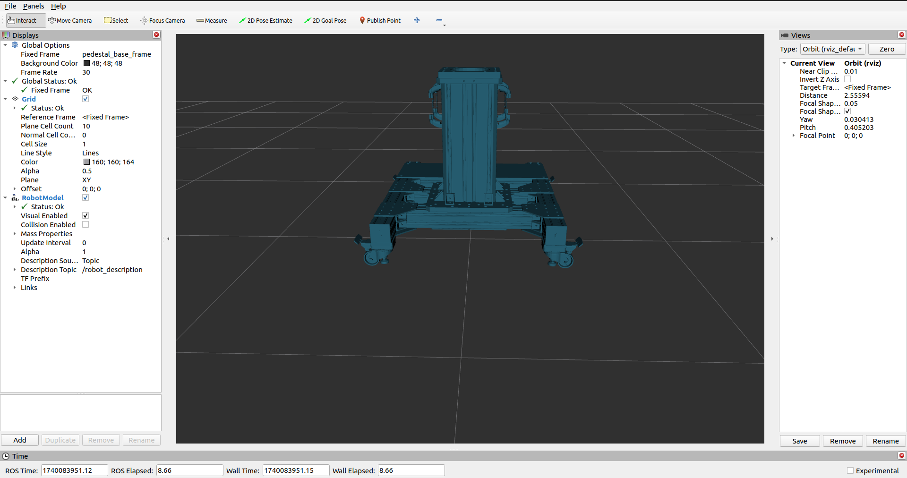

# pedestals_description
ROS2 description of robot pedestals

## Overview

The `pedestals_description` package provides a URDF description for the pedestals of the IDRA lab. Pedestals avialable:
- **kuka_pedestal**: Pedestal for the KUKA iiwa 14, to be used with [this repo](https://github.com/idra-lab/lbr_fri_ros2_stack/tree/pedestal) (pedestal branch);
- **doosan_pedestal**: Pedestal for the Doosan H2515 (to be added);

For each pedestal

The pedestal xacro defines two frames:
- **pedestal_base_frame:** Represents the base of the pedestal at ground level.
- **pedestal_top_frame:** Serves as the attachment point for the robot base.

A ROS 2 launch file processes these xacro files, merges their URDF outputs into a single robot description, and visualizes the model in RViz2.

## Usage (standalone)
To launch the pedestal description and view the model in `RViz2`, run:

```bash
ros2 launch pedestals_description display.launch.py pedestal_model:=kuka_pedestal
```


